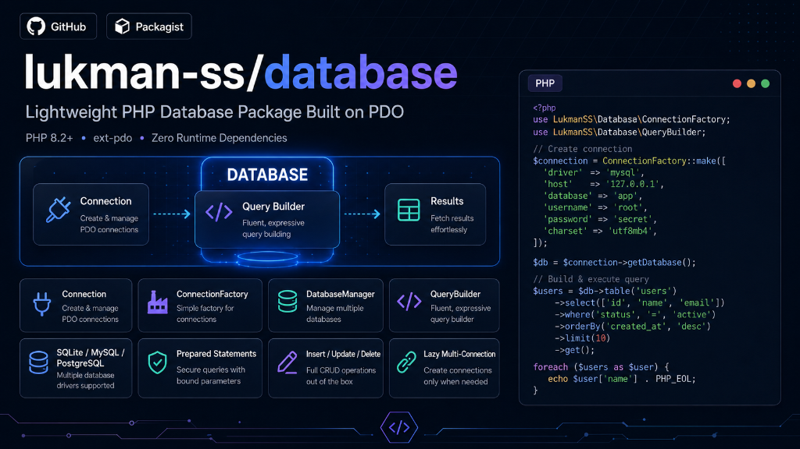

# Lukman Database



Lightweight PHP database package built on PDO.

## Requirements

- PHP 8.2 or higher
- PDO extension (`ext-pdo`)

## Installation

```bash
composer require lukman-ss/database
```

## SQLite Connection

```php
<?php

declare(strict_types=1);

use Lukman\Database\Connection;

$pdo = new PDO('sqlite::memory:');
$connection = new Connection($pdo);

$connection->statement('CREATE TABLE users (id INTEGER PRIMARY KEY AUTOINCREMENT, name TEXT NOT NULL)');
$connection->statement('INSERT INTO users (name) VALUES (?)', ['Alice']);

$users = $connection->select('SELECT * FROM users');
```

## ConnectionFactory

```php
<?php

declare(strict_types=1);

use Lukman\Database\ConnectionFactory;

$factory = new ConnectionFactory();

$connection = $factory->create([
    'driver' => 'sqlite',
    'database' => ':memory:',
]);
```

Supported DSN drivers are `sqlite`, `mysql`, and `pgsql`.

## DatabaseManager

```php
<?php

declare(strict_types=1);

use Lukman\Database\DatabaseManager;

$manager = new DatabaseManager();

$manager->addConnection('primary', [
    'driver' => 'sqlite',
    'database' => ':memory:',
], default: true);

$manager->addConnection('logs', [
    'driver' => 'sqlite',
    'database' => ':memory:',
]);

$primary = $manager->connection();
$logs = $manager->connection('logs');
```

Connections are created lazily and cached until `purge()`, `disconnect()`, or `reconnect()` is called.

## Select Query

```php
<?php

declare(strict_types=1);

use Lukman\Database\QueryBuilder;

$rows = (new QueryBuilder($connection))
    ->table('users')
    ->select('id', 'name')
    ->where('active', 1)
    ->orWhere('email', 'alice@example.com')
    ->orderBy('id', 'desc')
    ->limit(10)
    ->offset(0)
    ->get();

$first = (new QueryBuilder($connection))
    ->table('users')
    ->where('id', 1)
    ->first();
```

## Insert, Update, Delete

```php
<?php

declare(strict_types=1);

use Lukman\Database\QueryBuilder;

$id = (new QueryBuilder($connection))
    ->table('users')
    ->insertGetId([
        'name' => 'Alice',
        'email' => 'alice@example.com',
        'active' => 1,
    ]);

(new QueryBuilder($connection))
    ->table('users')
    ->insert([
        ['name' => 'Bob', 'email' => 'bob@example.com', 'active' => 1],
        ['name' => 'Charlie', 'email' => 'charlie@example.com', 'active' => 0],
    ]);

$updated = (new QueryBuilder($connection))
    ->table('users')
    ->where('id', $id)
    ->update(['active' => 0]);

$deleted = (new QueryBuilder($connection))
    ->table('users')
    ->where('active', 0)
    ->delete();
```

## Raw Query Parts

```php
<?php

declare(strict_types=1);

use Lukman\Database\Expression;
use Lukman\Database\QueryBuilder;

$count = (new QueryBuilder($connection))
    ->table('users')
    ->select(new Expression('COUNT(*) AS total'))
    ->first();

$rows = (new QueryBuilder($connection))
    ->table('users')
    ->selectRaw('COUNT(CASE WHEN active = ? THEN 1 END) AS active_total', [1])
    ->whereRaw('email LIKE ?', ['%@example.com'])
    ->get();
```

## Joins

```php
<?php

declare(strict_types=1);

use Lukman\Database\QueryBuilder;

$rows = (new QueryBuilder($connection))
    ->table('users')
    ->select('users.name', 'posts.title')
    ->join('posts', 'posts.user_id', '=', 'users.id')
    ->where('posts.published', 1)
    ->get();

$rows = (new QueryBuilder($connection))
    ->table('users')
    ->select('users.name', 'posts.title')
    ->leftJoin('posts', 'posts.user_id', '=', 'users.id')
    ->get();
```

Only inner join and left join are supported.

## Transactions

```php
<?php

declare(strict_types=1);

$connection->transaction(function ($connection): void {
    $connection->statement('INSERT INTO users (name) VALUES (?)', ['Alice']);
    $connection->statement('INSERT INTO users (name) VALUES (?)', ['Bob']);
});
```

Nested transactions are supported without savepoints.

## Schema Builder

```php
<?php

declare(strict_types=1);

use Lukman\Database\Schema\Blueprint;
use Lukman\Database\Schema\SchemaBuilder;

$schema = new SchemaBuilder($connection);

$schema->create('users', function (Blueprint $table): void {
    $table->id();
    $table->string('name');
    $table->string('email');
    $table->integer('age')->nullable();
    $table->boolean('active')->default(true);
});

$exists = $schema->hasTable('users');

$schema->dropIfExists('users');
```

Schema support is limited to SQLite create/drop helpers. Alter table and foreign keys are not implemented.

## Error Handling

- Query execution errors throw `Lukman\Database\Exception\QueryException`.
- Connection and configuration errors throw `Lukman\Database\Exception\ConnectionException`.

## Testing

```bash
composer test
```
